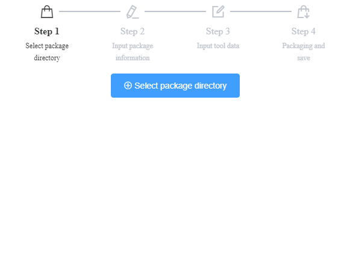
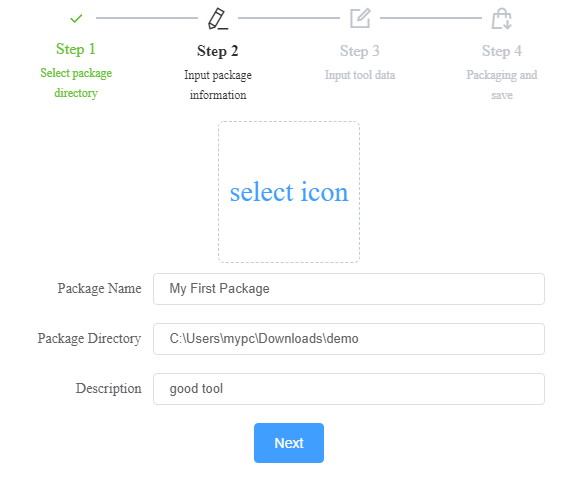
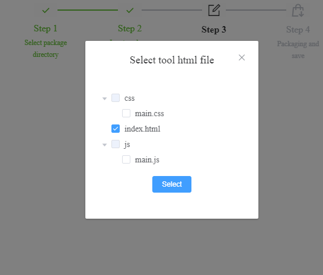
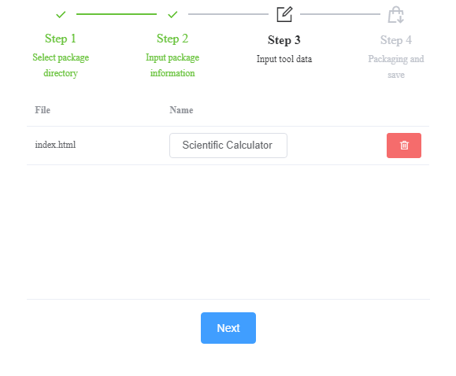
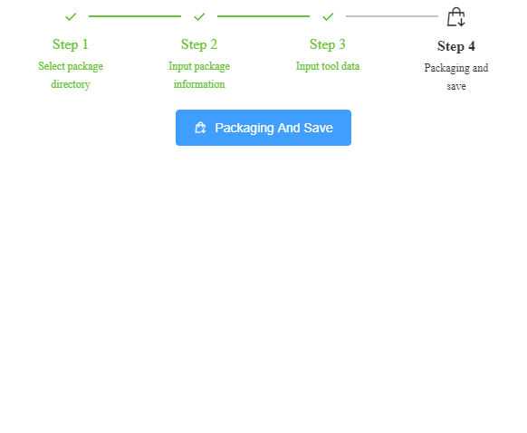

# DN Tool Packager

It is used to package custom tools for [DN tool Container](https://github.com/como65416/DnToolContainer).

## Download

[GitHub Releases](https://github.com/como65416/dn-tool-packager/releases)

## Usage

- Select the directory which you want to package.

- Input package information

- Select the tool html file(s).

- Download the package

